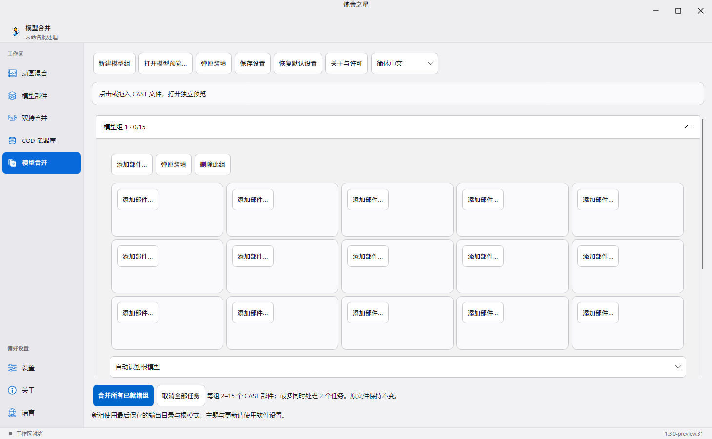
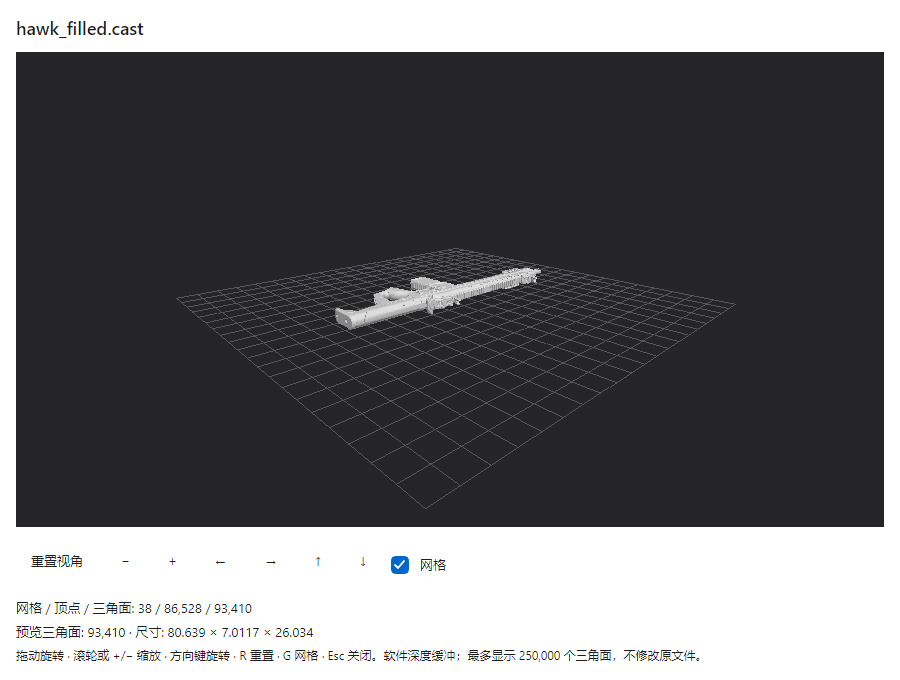

[**English**](README.md) | [简体中文](README.zh-CN.md)

<div align="center">

# Alchemy Stars · 炼金之星

**From weapon parts to bound models. From animation layers to export-ready assets.**

[](https://github.com/ez4cywa/Alchemy-Stars/releases/latest)
[](https://github.com/ez4cywa/Alchemy-Stars/releases/tag/v1.3.0-preview.31)
[](https://github.com/ez4cywa/Alchemy-Stars/releases)
[](fork/AlchemyStars/LICENSE)

[**Download**](#choose-your-release) · [Quick start](#quick-start-preview) · [User guide](https://github.com/ez4cywa/Alchemy-Stars/blob/codex/avalonia-aot/docs/avalonia-aot-user-guide.md) · [Release notes](https://github.com/ez4cywa/Alchemy-Stars/releases) · [Report an issue](https://github.com/ez4cywa/Alchemy-Stars/issues)

</div>

**A Windows desktop toolkit for first-person weapon animation and CAST model workflows.**

Blend animation layers, solve hand IK, assemble model parts and export assets for Maya or Blender. The Avalonia preview also includes grouped model merging, ammunition filling, independent model previews and a COD weapon database.



*Actual 1.3.0-preview.31 interface with an empty model group, shown in Chinese. This is not the stable WPF interface.*

## Choose your release

| Channel | Download | Source | Run after extracting |
| --- | --- | --- | --- |
| Stable · 1.1.9 · WPF | [Stable release](https://github.com/ez4cywa/Alchemy-Stars/releases/tag/v1.1.9) | [`main`](https://github.com/ez4cywa/Alchemy-Stars/tree/main) | `Alchemy Stars.exe` |
| Preview · 1.3.0-preview.31 · Avalonia / Native AOT | [Preview release](https://github.com/ez4cywa/Alchemy-Stars/releases/tag/v1.3.0-preview.31) | [`codex/avalonia-aot`](https://github.com/ez4cywa/Alchemy-Stars/tree/codex/avalonia-aot) | `AlchemyStars.Avalonia.exe` |

The preview is a Windows x64 self-contained package: keep its native DLLs and `Converters` folder together; no .NET or Rust installation is required. FBX conversion requires a local Blender or Maya installation. Preview features are **not** included in the stable executable or the source on `main`.

The stable build requires [.NET 9 Desktop Runtime (x64)](https://dotnet.microsoft.com/download/dotnet/9.0). Download the preview ZIP from its Release's Assets section; source-code archives are not runnable app packages.

## Preview workspace

| Workspace | What it does |
| --- | --- |
| Animation blend | Animation layers, hand poses, IK, configurable frame rate and separate bound-model export |
| Model parts | Classifies hands, weapons and attachments; preserves skeleton relationships and skin weights |
| Dual-wield composition | Combines left/right animation tasks and exports paired weapon models |
| Model merger · Ctrl+7 | ModelMergerGUI 2.2.2 core; 2–15 parts per group, automatic/manual root, two concurrent tasks, progress, cancellation and overwrite confirmation |
| Ammunition filling | Magazine/slot inspection, opt-in extra slots and spare magazine replication; skips occupied slots and writes a new CAST |
| Independent model preview | Multiple read-only windows, orbit/zoom/grid controls, u32 indices, up to 250,000 displayed triangles and software depth testing |
| COD weapon database | Offline weapon/codename and blueprint lookup, online database updates and optional Wiki reference icons |

The merger module supports Chinese, English, French, Russian and Spanish; the host interface supports Chinese and English. Preview sampling does not alter exported geometry. Existing Unity projects are not modified; export through the documented CAST/FBX workflow rather than treating CAST as a native Unity format.

[Preview quick guide](https://github.com/ez4cywa/Alchemy-Stars/blob/codex/avalonia-aot/docs/avalonia-aot-user-guide.md) · [Model merger guide / 功能对照](https://github.com/ez4cywa/Alchemy-Stars/blob/codex/avalonia-aot/docs/model-merger.zh-CN.md) · [Release notes and validation](https://github.com/ez4cywa/Alchemy-Stars/blob/codex/avalonia-aot/docs/releases/1.3.0-preview.31.zh-CN.md) · [Report an issue](https://github.com/ez4cywa/Alchemy-Stars/issues)

## Quick start (preview)

1. Download `AlchemyStars-1.3.0-preview.31-win-x64.zip`, extract the complete archive and run `AlchemyStars.Avalonia.exe`.
2. Choose your workspace: **Model parts** and **Animation blend** for animation work, or **Model merger** (`Ctrl+7`) to assemble CAST parts.
3. Add your assets, explicitly select an output folder, preview and export. Project files store absolute paths; reselect assets after moving computers. The app does not download game assets.

| Task | Workflow |
| --- | --- |
| Combine hands, a weapon and animation | Import hands, weapon and attachments in Model parts → add base animation and layers → configure poses and IK → export animation and its companion bound model |
| Merge weapon components | Model merger → add 2–15 CAST parts per group → detect or select the root → choose output → merge ready groups |
| Fill a magazine | Model merger → ammunition filling → choose weapon and ammunition CAST → inspect slots → opt into spare magazines if needed → save a new file |
| Find weapon codenames and blueprints | COD weapon DB → search offline → optionally update the database or load Wiki icons |



*Actual read-only CAST preview: 38 meshes, 86,528 vertices and 93,410 triangles. Untextured geometry does not represent final in-game materials.*

## Formats and boundaries

| Area | Current behavior |
| --- | --- |
| Animation export | CAST, FBX, SMD and SEAnim; preview animation CAST is animation-only, with bound models exported separately |
| Model merging and filling | Reads and writes CAST; filling requires a supported single-bone `tag_ammo` ammunition model—see the merger guide |
| FBX conversion | Requires a local Blender or Maya installation; a conversion runtime is not bundled |
| Independent model preview | Software depth buffer, up to 250,000 displayed triangles; sampling changes neither source nor exported geometry and does not promise upstream wgpu performance |
| Unity | Import through supported formats such as FBX; this release does not modify Unity projects and has not been validated inside the Unity Editor |
| Network and languages | Asset processing is local; updates and Wiki icons need internet access. Chinese/English host UI, plus French/Russian/Spanish in the merger module |

Stable 1.1.9 exports a full-scene CAST by default, unlike the preview's separate animation/model workflow. Matching bone names alone do not make an old skeleton compatible with a new animation: skeleton structure and bind pose must match.

## Build and validation

These commands target the **Avalonia preview branch**. Development requires Windows x64, the .NET 11 Preview SDK specified by `global.json`, the Rust MSVC toolchain and Visual Studio C++ build tools for Native AOT. End users do not need these tools.

```powershell
git clone --recurse-submodules --branch codex/avalonia-aot https://github.com/ez4cywa/Alchemy-Stars.git
cd Alchemy-Stars
.\scripts\build-model-merger.ps1
dotnet restore fork/AlchemyStars/src/AlchemyStars.Avalonia/AlchemyStars.Avalonia.csproj -r win-x64
.\scripts\verify-avalonia-aot.ps1
```

Local preview.31 validation covered 38 Rust tests, C# service/workspace checks, Native AOT window/export regressions, real Hawk merging and filling, and a Blender 4.0.2 FBX round trip. An old Hawk project with missing asset paths was skipped and replaced by checks using available local assets. Textures and Unity projects were not validated. Two Avalonia Win32 DComposition compiler diagnostics remain in Native AOT builds. These are release-time results, not a live CI status claim.

See the [preview.31 validation record](https://github.com/ez4cywa/Alchemy-Stars/blob/codex/avalonia-aot/docs/releases/1.3.0-preview.31.zh-CN.md) for evidence and limitations. Stable .NET 9 build instructions remain in the expanded section below.

## Source map and contributions

This map describes the preview branch; `main` retains the stable implementation.

```text
fork/AlchemyStars/src/AlchemyStars.Avalonia/  Desktop workspaces and preview UI
fork/AlchemyStars/src/AlchemyStars.Engine/    Shared processing engine
fork/RedFox/                                Pinned animation pipeline submodule
third_party/modelmerger/                    ModelMergerGUI Rust core
third_party/cast/                           CAST format and import components
scripts/                                   Build, release and regression checks
docs/                                      Guides and release validation records
```

[Issues](https://github.com/ez4cywa/Alchemy-Stars/issues) and pull requests are welcome. Include the app version, workspace, reproduction steps, error logs and a shareable minimal asset. If assets cannot be shared, start with the skeleton structure and relevant settings. Specify whether your change targets stable `main` or preview `codex/avalonia-aot`.

Based on [Scobalula/Alchemist](https://github.com/Scobalula/Alchemist) and RedFox. The improved Alchemist source uses [GPL-3.0](fork/AlchemyStars/LICENSE). CAST components and the preview's integrated [ModelMergerGUI](https://github.com/ez4cywa/ModelMergerGUI) core retain their MIT licenses. See the [stable notices](THIRD_PARTY_NOTICES.md) and [preview notices](https://github.com/ez4cywa/Alchemy-Stars/blob/codex/avalonia-aot/THIRD_PARTY_NOTICES.md). Tool licensing does not grant redistribution rights to game assets.

## Stable 1.1.9 detailed guide

<details>
<summary>Expand WPF usage, upstream improvements, Maya 2025 validation and build instructions</summary>

The sections below describe the stable 1.1.9 workflow. Use the preview guide above for the Avalonia interface and its newer features.

Alchemy Stars (炼金之星) is a production-focused improvement of [Scobalula/Alchemist](https://github.com/Scobalula/Alchemist) for Windows, first-person CAST weapon assets, and Autodesk Maya 2025. It retains Alchemist's WPF batch interface and RedFox animation pipeline while completing a reliable model-and-animation export workflow.

The maintained source lives in `fork/AlchemyStars` and pins the matching RedFox revision to keep builds reproducible. The earlier standalone rewrite remains preserved on the `independent-rewrite-v1` branch and is no longer the active implementation.

## Improvements over upstream Alchemist

| Area | Upstream Alchemist | Alchemy Stars 1.1.9 |
| --- | --- | --- |
| Maya model and animation | Import behavior can leave duplicate skeletons or lose weapon motion | Uses hierarchy-aware bone identities, remaps skin weights, and emits one baked animation per file |
| Output formats | Primarily CAST / SEAnim | Adds real FBX and native SMD while retaining CAST / SEAnim |
| FBX workflow | Not provided | Detects the local Maya installation and uses the official `fbxmaya` plug-in without bundling a large conversion runtime |
| Asset import | Primarily the original UI controls | System file dialogs, editable/pasteable path fields, targeted path drops, blank-area context menus, and `Shift+F10`; drops over animation layers are routed there first |
| Localization | Original UI capability | Follows the system language by default, can be pinned to Simplified Chinese or English, and refreshes open About content |
| Continuity | Project files retain absolute paths | Also remembers recent animation, layer, model, project, and output folders by category |
| UI and distribution | Original settings layout and icons | Purpose-specific icons, unclipped tabbed settings, protected language/About controls, and a compact framework-dependent package |
| Regression validation | Upstream examples | Preserves the original MP5 examples byte-for-byte and validates CAST, FBX, SMD, IK, skinning, and weapon motion with real Hawk, 1911 and P27 assets |

Alchemy Stars keeps the upstream animation-layer concepts intact. Attribution and licenses for Alchemist, RedFox, and the CAST components are included in every release package.

## Highlights

- Preserves distinct same-name bones: the wrist helper remains `j_gun`, while the weapon root becomes `j_gun__weapon` under `tag_weapon`. Model, skin and animation exports share one mapping.
- Normalizes model order as ViewHands → Weapon → Attachment and physically combines all parts before export.
- Keeps every mesh, material, and remapped skin weight in each CAST while including exactly one selected baked animation.
- Preserves Normal, Additive, Gesture, GesturePose, positive offsets, and negative offsets through the RedFox sampling pipeline.
- Rejects cyclic IK targets and fixes two-bone IK and animation-clone state loss.
- Restores layer and part ownership after project loading so reorder, remove, and drag operations remain usable.
- Supports `.cast`, `.fbx`, `.smd`, and `.seanim`; SMD contains the full skeleton and per-frame local transforms, while FBX preserves models, skinning, and animation through Maya.
- Optionally writes a true animation-only CAST with no model, mesh, material, or skin data; full-scene CAST remains the default.
- Optionally bakes only bones referenced by the base animation, poses, layers, or IK, while automatically retaining any indirectly changed bone and falling back to all bones for unknown solvers.
- Uses system file dialogs for animation, pose-layer, model, project, and output paths; each path box also accepts typed, pasted, or directly dropped paths and remembers the most recent folder for its category.
- Leaves the output folder blank for every newly imported animation. Export therefore requires an explicit destination and cannot silently replace a same-named source CAST; existing projects retain their saved destinations.
- Offers Follow System, Simplified Chinese, and English interface modes.
- Keeps all completion, warning, and error dialogs centered over the application; long diagnostics are scrollable and copyable.
- Uses a redesigned alchemy-flask-and-star application icon and function-specific toolbar icons.

## Download and use

Download the app ZIP from the [stable 1.1.9 release](https://github.com/ez4cywa/Alchemy-Stars/releases/tag/v1.1.9), extract it, and run:

`Alchemy Stars.exe`

The app starts with an empty batch. Use the toolbar buttons, the folder buttons beside path fields, or the context menus to select assets with the system file browser. Existing path boxes remain editable: type or paste a path, or drop a CAST file directly on its intended field. Dropping a file on an output-folder field uses that file's containing directory.

For safety, a newly imported animation has no default output folder. Choose, paste, type, or drop an output destination before exporting. This prevents a same-named `.cast` output from overwriting the input animation. Replacing the input animation does not repopulate the destination, while an output folder explicitly stored in an existing `.aprj` remains unchanged.

Open **Settings → Output** to choose `.cast`, `.fbx`, `.smd`, or `.seanim` as the default output format. For `.cast`, **Animation-only CAST** omits the complete model scene. **Bake relevant bones only** reduces baked curves to source-animation, pose, layer, IK, and indirectly changed bones. Both options apply immediately, are remembered globally, and are stored in project files.

Relevant-bone baking is off by default for maximum compatibility. It is safe for a full-scene export when the retained curves pass validation. When importing an animation-only CAST onto an existing rig, use the exact matching skeleton in a clean bind pose; otherwise leave this option off. SMD must still write a complete pose on every frame. FBX requires a locally installed Maya, with Maya 2025 preferred.

On the Animation page, right-click anywhere in the main list—including blank space—and choose **Import animations…**. The animation-layer area has its own **Import animation layers…** menu. When an external file is dropped over an animation-layer area, that hovered animation takes priority over the outer selection. The Model Parts list offers the same blank-area right-click workflow. All lists also support `Shift+F10`.

Each batch entry produces a separate file containing one baked animation. Project files store absolute paths; after moving to another computer, reselect the assets and output directory, then use **Save Project As**.

## Standard examples

The release directory and ZIP include the complete `Example` folder. `MP5Base.aprj` and `MP5Grip.aprj` are migrated directly from upstream Alchemist and remain byte-identical. `manifest.json` records the required files, structure, and checksums. Improved Hawk sprint, idle, and batch projects live under `Example/Hawk`.

After extracting a release, open `Example/README.en-US.md`; the Chinese guide is `Example/README.zh-CN.md`. Online copies are available in the [English example guide](https://github.com/ez4cywa/Alchemy-Stars/blob/main/fork/AlchemyStars/Example/README.en-US.md) and [Chinese example guide](https://github.com/ez4cywa/Alchemy-Stars/blob/main/fork/AlchemyStars/Example/README.zh-CN.md).

Examples are not loaded automatically. Open or drop an `.aprj` file, or pass it as a command-line argument. Future Hawk sprint checks use `Example/Hawk/HawkSprint.aprj` as the single source of truth: idle base animation, two ordered additive layers, IK, model parts, format, and output naming all come from that project.

## Maya 2025

The release `MayaPlugin` directory contains the CAST importer. Copy `cast.py` and `castplugin.py` into a Maya script or plug-in path, load `castplugin.py` in Plug-in Manager, and import the generated CAST through **File → Import**.

For FBX, Alchemy Stars locates the local Maya installation and invokes `fbxmaya`. Set `ALCHEMY_STARS_MAYAPY` to select a particular `mayapy.exe`. Conversion is isolated in an ASCII-only temporary workspace, so Chinese Windows user names, output folders, and output file names remain supported despite the Maya 2025 FBX plug-in's path limitation. Enable **Fill Timeline** when manually importing FBX into Maya.

The Hawk sprint release artifact has been tested headlessly in Maya 2025 with:

- 215 joints, one skeleton root, and separate wrist-helper and weapon-root joints;
- 21 imported and visible skinned meshes;
- 1,290 translation/rotation curves with every transform channel keyed on every frame;
- 30 FPS and a 0–66 playback range;
- left-hand IK validated against the physically reachable target;
- preserved right-hand and weapon motion, with the weapon root following `tag_weapon`.

The relevant-bone Hawk variant retains 121 of 215 bones. Every retained transform curve is compared with the full bake, every omitted target is confirmed to remain at bind pose, and the reduced full-scene CAST is imported separately in Maya 2025.

The 1.1.8 weapon regression also covers the original 1911 project and P27 ADS. It compares every joint at every frame across full, selective and animation-only CAST, independently assembled source rigs, FBX, and SMD. Source-animation references normalize quantized quaternions and sample short additive layers across the full range before Maya import; this preserves the represented rotations and the original project's persistent-offset semantics. Results are recorded in `fork/AlchemyStars/output/weapon-regression/weapon-regression.maya2025.json`.

For weapon parts with an empty parent, a unique `tag_weapon` is resolved during export; otherwise export asks for a parent. Existing explicit parents are honored. Set older Hawk projects that used `j_gun` to `tag_weapon` and re-export into a new destination. Animation-only files must be used with the matching 1.1.8 skeleton; old merged scenes need to be regenerated.

The generated report is `fork/AlchemyStars/output/sat_vm_ar_hawk_sprint_alchemy_stars.maya2025.json`.

## Build and validation

Development requires the .NET 9 SDK. The compact Windows x64 release is framework-dependent and requires the [.NET 9 Desktop Runtime (x64)](https://dotnet.microsoft.com/download/dotnet/9.0); it does not bundle .NET or Maya.

```powershell
.\scripts\run-tests.ps1
.\scripts\build-release.ps1
```

`run-tests.ps1` builds the improved upstream project, verifies that the standard MP5 examples were not modified, generates actual Hawk CAST/SMD/FBX outputs, and reimports full and relevant-bone CAST plus FBX into Maya 2025 when available. It checks the skeleton, meshes, skinning, frame range, IK, weapon animation, animation-only CAST contents, retained-curve equivalence, weapon-first model ordering, and Chinese TEMP/output paths and names. The UI smoke suite checks centered dialogs, the protected language/About layout, settings clipping, four format choices, output-option accessibility, three language modes, toolbar controls, and context imports.

Every functional release change increments at least the patch version; this version is `1.1.9`.

The 1.1.9 UI audit fixes the clipped About icon, toolbar overflow, cramped layer paths, and low-contrast controls. See the [UI audit and validation notes](design-system/alchemy-stars/pages/ui-audit-1.1.9.md) for coverage and limitations.

## Source and licenses

- Improved Alchemist source: `fork/AlchemyStars`, GPL-3.0; see `fork/AlchemyStars/LICENSE`.
- Pinned RedFox revision: `fork/RedFox` Git submodule.
- Maya CAST plug-in: `third_party/cast`, MIT; see `THIRD_PARTY_NOTICES.md`.

Upstream baseline: Alchemist `d86da66536ed3bf304a5cb7142d360fb934f73fb`; RedFox `7031da79614d1d979b1f17cae9d4bda2c699fd53`.

</details>
